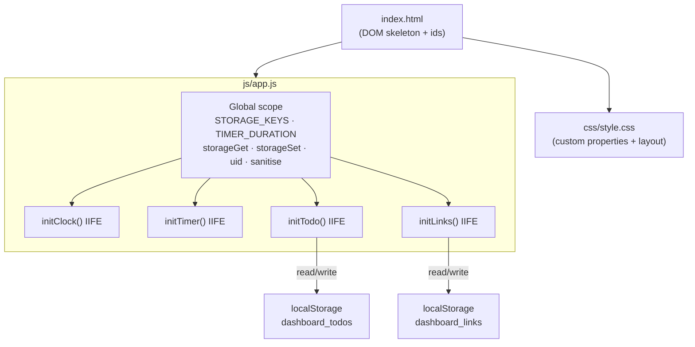
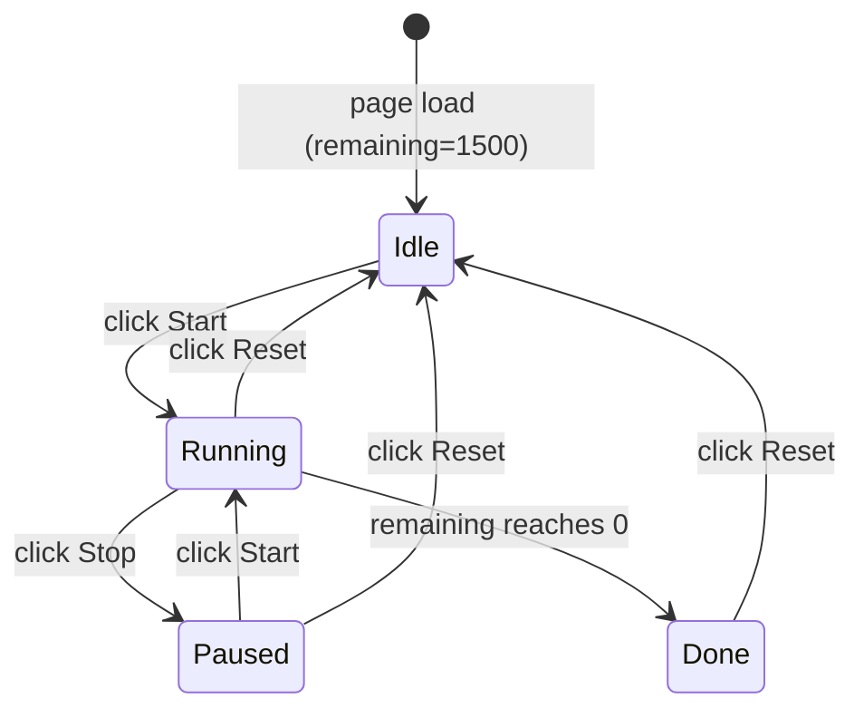

# Design Document — To-Do List Life Dashboard

## Overview

To-Do List Life Dashboard is a single-page productivity web application built with plain HTML, CSS, and Vanilla JavaScript — no frameworks, no build step, no backend. It runs entirely in the browser and persists all user data through the Web Storage API (`localStorage`).

The page presents four widgets in a unified dashboard:

| Widget | Purpose |
|---|---|
| **Greeting & Clock** | Displays real-time clock, current date, and a time-based greeting |
| **Focus Timer** | 25-minute Pomodoro countdown with Start / Stop / Reset controls |
| **To-Do List** | Full CRUD management of daily tasks with completion tracking |
| **Quick Links** | Save and open favourite URLs via a pill-chip navigation area |

Because there is no module bundler or server, every piece of code must work when the HTML file is opened directly with a `file://` URL in any modern browser (Chrome, Firefox, Edge, Safari).

---

## Architecture

The application follows a **module-pattern IIFE** architecture: all logic lives inside immediately-invoked function expressions that share only the minimal global utilities they need. This avoids polluting the global namespace while keeping the codebase in a single file.



**Execution order on page load** — because `<script src="js/app.js">` is placed at the end of `<body>`, the DOM is fully parsed before any JavaScript runs. All four IIFEs execute synchronously in declaration order:

1. `initClock()` — calls `tick()` immediately, then schedules `setInterval(tick, 1000)`.
2. `initTimer()` — calls `render()` to paint the initial `25:00` state.
3. `initTodo()` — reads `localStorage`, then calls `render()`.
4. `initLinks()` — reads `localStorage`, then calls `render()`.

---

## Components and Interfaces

### Global Utilities

These functions are declared in the top-level scope so every IIFE can call them without being passed as arguments.

| Function | Signature | Description |
|---|---|---|
| `storageGet` | `(key: string, fallback: T) → T` | Reads `localStorage[key]`, parses JSON. Returns `fallback` on missing key or parse error. |
| `storageSet` | `(key: string, value: T) → void` | Serialises `value` to JSON and writes to `localStorage[key]`. Silently catches quota errors. |
| `uid` | `() → string` | Returns a collision-resistant ID: `Date.now().toString(36) + Math.random().toString(36).slice(2,7)`. |
| `sanitise` | `(str: string) → string` | XSS mitigation: creates a detached `<span>`, assigns to `textContent`, returns `innerHTML` — HTML special chars become entities. |

Storage keys are centralised:
```js
const STORAGE_KEYS = { TODOS: "dashboard_todos", LINKS: "dashboard_links" };
const TIMER_DURATION = 1500; // 25 × 60 seconds
```

---

### Greeting & Clock Widget (`initClock`)

**DOM dependencies:** `#greeting-text`, `#current-time`, `#current-date`

**Internal interface:**

```
tick() → void
  Reads: new Date()
  Writes: textContent of all three DOM nodes

getGreeting(h: number) → string
  h ∈ [5, 11]  → "Good Morning! ☀️"
  h ∈ [12, 16] → "Good Afternoon! 🌤️"
  h ∈ [17, 20] → "Good Evening! 🌆"
  h ∈ other    → "Good Night! 🌙"
```

`tick()` runs once on init, then every `1000 ms` via `setInterval`. The greeting comparison uses the integer hour, so transitions happen exactly on the hour without any page reload.

---

### Focus Timer Widget (`initTimer`)

**DOM dependencies:** `#timer-display`, `#timer-label`, `#btn-start`, `#btn-stop`, `#btn-reset`

**State variables:**

| Variable | Type | Initial | Meaning |
|---|---|---|---|
| `remaining` | `number` | `1500` | Seconds left on the timer |
| `intervalId` | `number \| null` | `null` | Handle returned by `setInterval` |
| `isRunning` | `boolean` | `false` | Whether the countdown is active |

**State machine:**



**`render()` responsibilities:**

- Formats `remaining` as `MM:SS` with zero-padding.
- Applies CSS class to `#timer-display`: `.running` (green, `remaining > 300`), `.warning` (orange, `1 ≤ remaining ≤ 300`), `.done` (red, `remaining === 0`).
- Updates `#timer-label` with a contextual string.
- Sets `btnStart.disabled = isRunning || remaining === 0`.
- Sets `btnStop.disabled = !isRunning`.
- Mirrors `.disabled` state as `opacity: 0.4` via direct inline style.

**`tick()` — called by `setInterval` every 1000 ms:**

1. If `remaining ≤ 0`, clear interval, set `isRunning = false`, call `render()`, return.
2. Decrement `remaining` by 1.
3. Call `render()`.

---

### To-Do List Widget (`initTodo`)

**DOM dependencies:** `#todo-input`, `#btn-add-todo`, `#todo-list`, `#todo-empty`, `#modal-overlay`, `#modal-input`, `#btn-modal-save`, `#btn-modal-cancel`

**In-memory state:**

```js
let todos     = storageGet(STORAGE_KEYS.TODOS, []);  // Task[]
let editingId = null;                                  // string | null
```

**`render()` responsibilities:**

1. Clears `#todo-list` innerHTML.
2. Toggles visibility of `#todo-empty` based on `todos.length`.
3. Sorts a shallow copy: active tasks (`done === false`) before completed.
4. For each item, creates an `<li class="todo-item [done]">` containing:
   - `<input type="checkbox" class="todo-checkbox">` — toggling calls `save()` + `render()`.
   - `<span class="todo-text">` — content via `sanitise()`.
   - `<div class="todo-actions">` — edit button (opens modal) and delete button (filters array).

**`addTodo()` flow:**

```
trim(inputEl.value)
  └─ empty? → focus input, return
  └─ valid  → push { id: uid(), text, done: false }
              → save() → render()
              → clear input, refocus
```

**Edit modal flow:**

```
openModal(id, text)  → editingId = id; fill modal-input; add .open to overlay
saveModal()          → trim modal-input
                       └─ empty? → return (no change)
                       └─ valid  → update todos[].text; save(); render(); closeModal()
closeModal()         → remove .open; editingId = null
```

Modal is dismissed by: Save button, Enter key in `#modal-input`, Cancel button, Escape key, or click on overlay backdrop.

---

### Quick Links Widget (`initLinks`)

**DOM dependencies:** `#link-name-input`, `#link-url-input`, `#btn-add-link`, `#links-grid`, `#links-empty`

**In-memory state:**

```js
let links = storageGet(STORAGE_KEYS.LINKS, []);  // Link[]
```

**`render()` responsibilities:**

1. Clears `#links-grid` innerHTML.
2. Toggles `#links-empty` visibility.
3. For each link, creates `<a class="link-chip" href="..." target="_blank" rel="noopener noreferrer">` containing:
   - `` — favicon via `https://www.google.com/s2/favicons?sz=16&domain_url=<encoded-url>` (hidden on error).
   - Sanitised `link.name` as text node.
   - `<button class="link-chip-delete">` — calls `e.preventDefault()` to block anchor navigation, then filters `links`, saves, renders.

**`normaliseUrl(raw)` flow:**

```
trim(raw)
  └─ empty string? → return null
  └─ has "http://" or "https://"? → use as-is
  └─ else           → prepend "https://"
  └─ new URL(withProto) throws? → return null
  └─ success        → return withProto
```

**`addLink()` flow:**

```
name = trim(nameInputEl.value)   → empty? focus name input, return
url  = normaliseUrl(urlInputEl.value) → null? focus url input, return
→ push { id: uid(), name, url }
→ save() → render()
→ clear both inputs, focus name input
```

Keyboard shortcuts: Enter in `#link-url-input` → `addLink()`; Enter in `#link-name-input` → focus URL input.

---

## Data Models

### Task

```ts
interface Task {
  id:   string;   // uid() — collision-resistant alphanumeric
  text: string;   // User-supplied description (1–120 chars, trimmed)
  done: boolean;  // false = active, true = completed
}
```

Stored under `localStorage["dashboard_todos"]` as a JSON array.

### Link

```ts
interface Link {
  id:   string;   // uid()
  name: string;   // Display label (1–30 chars, trimmed)
  url:  string;   // Full URL — always has "http://" or "https://" prefix
}
```

Stored under `localStorage["dashboard_links"]` as a JSON array.

### Storage contract

- **Write path:** any mutation to `todos` or `links` is immediately followed by `storageSet()`.
- **Read path:** arrays are loaded once at IIFE init; all subsequent reads are from the in-memory array.
- **Error recovery:** `storageGet` returns the `fallback` value (empty array) on any JSON parse error and does not throw. A `console.warn` is emitted by `storageSet` on quota errors.

---

## Correctness Properties

*A property is a characteristic or behavior that should hold true across all valid executions of a system — essentially, a formal statement about what the system should do. Properties serve as the bridge between human-readable specifications and machine-verifiable correctness guarantees.*

### Property 1: Greeting covers all 24 hours without gaps

*For any* integer hour `H` in `[0, 23]`, `getGreeting(H)` must return exactly one of the four greeting strings. No hour may be unhandled, and no two ranges may overlap.

**Validates: Requirements 2.1, 2.2, 2.3, 2.4**

---

### Property 2: Timer tick decrements remaining by exactly 1

*For any* timer state where `isRunning = true` and `remaining > 0`, calling `tick()` must decrease `remaining` by exactly 1. The value of `remaining` must never go below 0.

**Validates: Requirements 3.3, 3.6**

---

### Property 3: Timer button state machine consistency

*For any* combination of `(isRunning, remaining)`, after calling `render()`, the disabled state of `btnStart` and `btnStop` must satisfy:
- `isRunning = true` → `btnStart.disabled = true`, `btnStop.disabled = false`
- `isRunning = false, remaining > 0` → `btnStart.disabled = false`, `btnStop.disabled = true`
- `remaining = 0` → `btnStart.disabled = true`, `btnStop.disabled = true`

**Validates: Requirements 4.1, 4.2, 4.3**

---

### Property 4: Task add roundtrip persists to storage

*For any* non-whitespace string `s`, after `addTodo()` is called with `s` in the input field, the `todos` array must contain exactly one new item with `text = s.trim()` and `done = false`, and `storageGet(STORAGE_KEYS.TODOS, [])` must return a deep-equal copy of the updated array.

**Validates: Requirements 5.2, 5.5, 9.1**

---

### Property 5: Whitespace input is rejected for tasks and links

*For any* string composed entirely of whitespace characters (including the empty string), calling `addTodo()` or `addLink()` must not increase the length of `todos` or `links`, and must not write a new entry to `localStorage`.

**Validates: Requirements 5.4, 10.3**

---

### Property 6: Task edit roundtrip

*For any* existing task with id `X` and any non-whitespace replacement text `T2`, after `saveModal()` is called with `T2` in `#modal-input`, `todos.find(t => t.id === X).text` must equal `T2.trim()`, and the updated array must be reflected in `localStorage`.

**Validates: Requirements 7.3, 7.6**

---

### Property 7: Task delete removes item completely

*For any* task with id `X` that exists in `todos`, after the delete action is triggered, `todos.find(t => t.id === X)` must be `undefined`, and `localStorage["dashboard_todos"]` must no longer contain an entry with that id.

**Validates: Requirements 8.2, 8.3**

---

### Property 8: Completed tasks always sort after active tasks

*For any* `todos` array containing a mix of completed and active tasks, after `render()` executes, every `<li>` element with the `.done` class must appear after every `<li>` element without the `.done` class in the rendered DOM order.

**Validates: Requirements 6.1, 6.2**

---

### Property 9: URL normalisation adds protocol and rejects invalids

*For any* string `s` that does not start with `http://` or `https://`, `normaliseUrl(s)` must return a string that starts with `"https://"` when `s` forms a valid URL after prepending the prefix, and must return `null` when `s` cannot form a valid URL.

**Validates: Requirements 10.4**

---

### Property 10: Storage roundtrip preserves data

*For any* array `A` of plain-object items, `storageGet(key, [])` called after `storageSet(key, A)` must return a value deep-equal to `A`. If the stored value is corrupted JSON, `storageGet` must return the fallback without throwing.

**Validates: Requirements 9.3, 12.3**

---

### Property 11: sanitise prevents HTML injection

*For any* string `s` containing the characters `<`, `>`, `"`, or `&`, `sanitise(s)` must return a string in which those characters appear only as their HTML entity equivalents (`&lt;`, `&gt;`, `&quot;`, `&amp;`), ensuring no raw HTML can be injected into the DOM via user-supplied task text or link names.

**Validates: Requirements 5.2, 7.3, 10.2**

---

## Error Handling

| Scenario | Handling |
|---|---|
| `localStorage` unavailable (private mode, quota exceeded) | `storageSet` catches and emits `console.warn`. App continues with in-memory state; data is not persisted for the session. |
| Malformed JSON in `localStorage` | `storageGet` catches `JSON.parse` error, returns `fallback` (empty array). App starts with an empty list. |
| User submits empty / whitespace-only task | Input is trimmed; empty result is detected before any mutation; `inputEl.focus()` is called to guide the user. |
| User submits empty / whitespace-only link name or invalid URL | Name emptiness check runs first; URL is run through `normaliseUrl()` which validates via `new URL()`; invalid URLs return `null` and the URL input receives focus. |
| Favicon image load failure | `onerror="this.style.display='none'"` hides the broken image; the link chip still displays the name and delete button. |
| XSS via task text or link name | `sanitise()` ensures all user strings are text-node-encoded before insertion into `innerHTML`. |

---

## Testing Strategy

The project uses **Vanilla JS with no build step**, so tests must run without a bundler. The recommended approach is [**Vitest**](https://vitest.dev/) (or Jest) for unit and property tests against pure functions extracted from `app.js`, combined with [**fast-check**](https://fast-check.io/) for property-based testing.

### Dual Testing Approach

- **Unit tests** — verify specific examples, edge cases, and integration between DOM and logic.
- **Property-based tests** — verify the eleven correctness properties above across a large randomised input space (minimum 100 iterations per property).

### Unit Tests (example-based)

| Area | What to test |
|---|---|
| `getGreeting` | Each of the four boundary hours (5, 12, 17, 22) and midnight (0) |
| `normaliseUrl` | Strings already with protocol, bare domains, malformed inputs (spaces only, gibberish) |
| `storageGet / storageSet` | Normal roundtrip, missing key fallback, corrupted JSON recovery |
| `sanitise` | `<script>` injection, `&` ampersand, `"` quote |
| Timer button states | Idle → Running → Paused → Done state transitions |
| Modal keyboard | Enter saves, Escape cancels, backdrop click cancels |
| Task sorting | Mixed done/undone array renders in correct DOM order |

### Property-Based Tests (fast-check)

Each property test references a design document property via comment tag:
`// Feature: todo-list-life-dashboard, Property N: <property_text>`

Minimum 100 iterations per property run (fast-check default is 100, configurable via `{ numRuns: 100 }`).

| Test | Generates | Asserts |
|---|---|---|
| **P1** — Greeting coverage | `fc.integer({ min: 0, max: 23 })` | Returns one of the four strings; no gaps; no overlaps |
| **P2** — Timer tick | Initial `remaining` in `[1, 1500]`, `isRunning = true` | `remaining` decreases by 1; never below 0 |
| **P3** — Button state machine | All valid `(isRunning, remaining)` combos | `btnStart.disabled` and `btnStop.disabled` match expected rules |
| **P4** — Task add roundtrip | `fc.string({ minLength: 1 }).filter(s => s.trim().length > 0)` | `todos` grows by 1; new item has correct text and `done=false`; storage is updated |
| **P5** — Whitespace rejection | `fc.stringOf(fc.constantFrom(' ', '\t', '\n'))` | `todos.length` and `links.length` unchanged; storage unchanged |
| **P6** — Task edit roundtrip | Existing task + `fc.string().filter(...)` | `todos[id].text === newText.trim()`; storage updated |
| **P7** — Task delete | Existing task id | `todos` no longer contains id; storage updated |
| **P8** — Sort order | `fc.array(fc.record({ done: fc.boolean(), ... }))` | All `.done` DOM items appear after all non-done items |
| **P9** — URL normalisation | `fc.string()` without protocol prefix | Valid URLs return `"https://..."` string; invalid return `null` |
| **P10** — Storage roundtrip | `fc.array(fc.record({ id: fc.string(), text: fc.string(), done: fc.boolean() }))` | Deep-equal after get; corrupted JSON returns fallback |
| **P11** — XSS prevention | `fc.string()` containing `<`, `>`, `"`, `&` | Output contains no raw `<` or `>` characters |

### Running Tests

```sh
# Install test dependencies (one-time)
npm install --save-dev vitest fast-check

# Run all tests once (no watch mode)
npx vitest --run
```

No `package.json` exists in the project yet; the test setup requires adding one. Test files should live in a `__tests__/` directory at the project root and import pure functions extracted from `app.js` (or from a separate `src/` module if the code is refactored for testability).
